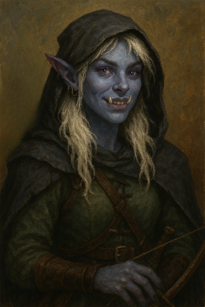

# Elyra

<table>
  <tr>
    <th rowspan="6">
      
    </th>
    <th>Race</th>
    <td><code>Half-Orc (Orc-Tiefling)</code></td>
  </tr>
  <tr>
    <th>Background</th>
    <td><code>Outlander</code></td>
  </tr>
  <tr>
    <th>Class</th>
    <td><code>Fighter</code></td>
  </tr>
  <tr>
    <th>Subclass</th>
    <td><code>Arcane Archer</code></td>
  </tr>
  <tr>
    <th>Alignment</th>
    <td><code>Chaotic Good</code></td>
  </tr>
  <tr>
    <th>Level</th>
    <td><code>2</code></td>
  </tr>
</table>


## Ability Scores

| Ability | Score |  MOD  | Proficient? | Save Bonus |
| :-----: | :---: | :---: | :---------: | :--------: |
|  `STR`  |  14   | `+2`  |     `X`     |  +4 (2+2)  |
|  `DEX`  |  17   | `+3`  |             |  +3 (3+0)  |
|  `CON`  |  14   | `+2`  |     `X`     |  +4 (2+2)  |
|  `INT`  |  10   | `+0`  |             |  +0 (0+0)  |
|  `WIS`  |  16   | `+3`  |             |  +3 (3+0)  |
|  `CHA`  |  15   | `+2`  |             |  +2 (2+0)  |

| Proficiency Bonus | Heroic Inspiration |
| :---------------: | :----------------: |
|        `2`        |        ` `         |

```
MOD = (Score - 10) / 2

Save Bonus = Ability MOD + Proficiency Bonus
```


```


## Combat Stats

### HP

| Current | Temp  |  Max  |
| :-----: | :---: | :---: |
|  `20`   |   0   |  20   |

### HIT DICE

| Left  | Used  | Total |
| :---: | :---: | :---: |
|  `2`  |   0   | 2d10  |

### Misc

| Armor | Init  | Speed  | Perception |   Size   |
| :---: | :---: | :----: | :--------: | :------: |
| `16`  |  `3`  | `30ft` |    `12`    | `Medium` |


```
Character creation:  HP = Hit Die max  + CON
Upon level-up:      +HP = Hit Die roll + CON

Max HP = Hit Die (max roll) + CON + Other Modifiers (e.g., racial bonuses, class features)

```

```
Short rest: Heal with Hit Dice.
Long  rest: Heal fully. Regain half of Hit Dice.
```

## Skills

| Skill            | Proficient? |  MOD  |
| ---------------- | :---------: | :---: |
| Acrobatics (Dex) |     `X`     | `+5`  |
| Stealth (Dex)    |     `X`     | `+5`  |
| Insight (Wis)    |     `X`     | `+5`  |
| Perception (Wis) |     `X`     | `+5`  |
| Survival (Wis)   |     `X`     | `+5`  |
|                  |             |       |
| ...              |             | `+0`  |

```
Skill MOD = Ability MOD + Proficiency Bonus
```

## Equipment Proficiencies

| Armor        | Weapon          | Tool |
| ------------ | --------------- | ---- |
| Light Armor  | Simple Weapons  | None |
| Medium Armor | Martial Weapons |      |
| Heavy Armor  |                 |      |
| Shields      |                 |      |
|              |                 |      |

## Weapons

| Name          | Proficient? | ATK Base | ATK Bonus  |   ATK    |   DMG Base   | DMG Bonus |   DMG   |
| ------------- | :---------: | :------: | :--------: | :------: | :----------: | :-------: | :-----: |
| Longbow (DEX) |     `X`     |   1d20   | +5 (3 + 2) | `1d20+5` | 1d8 piercing |    +3     | `1d8+3` |
| Dagger  (STR) |     `X`     |   1d20   | +4 (2 + 2) | `1d20+4` | 1d4 piercing |    +2     | `1d4+2` |
|               |             |          |            |          |              |           |         |

## Spells

| Name               |  Unlock  |  lvl  | Type  | Save  | Range |    Duration    |   Frequency   |  Usage   |
| ------------------ | :------: | :---: | :---: | :---: | :---: | :------------: | :-----------: | :------: |
| `Thaumaturgy`      |   `X`    |   ø   |       |       |       | Up to 1 minute |       ø       | Cantrip  |
| ~~Hellish Rebuke~~ | ~~lvl3~~ |   1   |  DEX  |  DEX  | 60ft  | Instantaneous  | 1 / Long Rest | Reaction |
| ~~Darkness~~       | ~~lvl5~~ |   2   |  DEX  |  DEX  | 60ft  | Concentration  | 1 / Long Rest |  Action  |
|                    |          |       |       |       |       |                |               |          |

```
ATK Bonus = Ability MOD + Proficiency Bonus + Other Modifiers
DMG Bonus = Ability MOD + Other Modifiers

ATK = 1d20 + ATK Bonus
DMG = DMG Base + DMG Bonus
```

## Class Features & Traits

| Name         | Frequency | Description           | Type    |
| ------------ | :-------: | --------------------- | ------- |
| Archery      |  Passive  | +2 ATK with ranged    | Style   |
| Second Wind  | 1 / Rest  | Self-Heal 1d10+lvl HP | Bonus   |
| Action surge | 1 / Rest  | Gain 1 extra action   | Feature |
|              |           |                       |         |

## Species traits

| Name                 |   Frequency   |
| -------------------- | :-----------: |
| Darkvision           |    Passive    |
| Hellish Resistance   |    Passive    |
| Relentless Endurance | 1 / Long Rest |
|                      |               |

| Infernal Legacy    | Unlock |  lvl  | Type  | Save  | Range |    Duration    |   Frequency   |  Usage   |
| ------------------ | :----: | :---: | :---: | :---: | :---: | :------------: | :-----------: | :------: |
| Thaumaturgy        |  `X`   |   ø   |   ø   |   ø   |   ø   | Up to 1 minute |       ø       | Cantrip  |
| ~~Hellish Rebuke~~ |  lvl3  |   1   |  DEX  |  DEX  | 60ft  | Instantaneous  | 1 / Long Rest | Reaction |
| ~~Darkness~~       |  lvl5  |   2   |  DEX  |  DEX  | 60ft  | Concentration  | 1 / Long Rest |  Action  |
|                    |        |       |       |       |       |                |               |          |

| Spell                | Description                               | Save     |
| -------------------- | ----------------------------------------- | -------- |
| Darkvision           | See in the dark (Colorblind)              |          |
| Hellish Resistance   | Fire damage immunity                      |          |
| Relentless Endurance | Upon being damaged to 0HP, survive at 1HP |          |
|                      |                                           |          |
| Thaumaturgy          | Minor supernatural effects                |          |
| Hellish Rebuke       | `2d10 + 1d10/lvl` fire damage             | Half DMG |
| Darkness             | 15ft Sphere of darkness, blinds in area   |          |


## Equipment

| Name            | Notes  |
| --------------- | :----: |
| Longbow         |        |
| Dagger          |        |
| Hooded Cloak    | `Worn` |
| Leather armor   | `Worn` |
| Backpack        |        |
| Explorers' Pack |        |
| 20 Arrows       |        |
|                 |        |


## Coins

| Plat  | Gold  | Copper |
| :---: | :---: | :----: |
|   0   |   2   |   5    |

## Spoken Languages

| Language | Proficient? |
| -------- | :---------: |
| Common   |      X      |
| Orcish   |      X      |
| Infernal |      X      |
| Asian    |      X      |

## Appearance

```
Lean, agile build, surprisingly tall.
Naturally brown, now white bleached hair, with roots starting to show through, falling down to her shoulders.
Always messy and getting in the way, but with refusal to keep them shorter.
Her tusks escaping her closed mouth and shining every time she grins.
Bright, lavender-gray eyes.
Lengthy, gentle fingers with nails kept long and sharp.
Almost always seen with a cloak over her head.
Pointy ears decorated with earrings.
```

## Personality

### Backstory

```
Born to a mother she never knew and raised by a harsh orc father, she grew to
resent his unyielding expectations. Among her peers, she hid her discomfort to
protect both flesh and soul. Though both tiefling and orc, her tusks remained a
stark reminder of what she wished to leave behind. Unable to fully escape her
heritage, she fled home with a bow, a dagger, and a cloak, seeking freedom in
Itharis.
```

### Personality Traits

Friendly, but distant when it comes to personal matters.

### Ideals

Freedom Seeks to define own path, away from father’s expectations.

### Bonds

Her bow and dagger represent her escape; she never parts with them.

### Flaws

Struggles to accept her orc heritage, leading to moments of self-doubt.

Silly demeanour. Doesn't show weak side. Playful, but distant in personal
topics.

---

## Notes

```
nothing yet
```

## Session Notes

```
nothing yet
```
