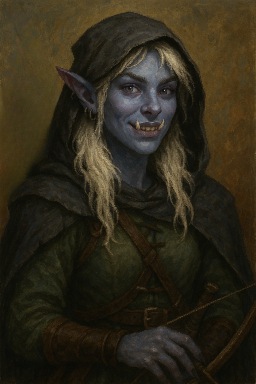

# Elyra

| Attribute       |      Details      |
| --------------- | :---------------: |
| **Race**        |     Orc-ling      |
| **Background**  |     Outlander     |
| **Class**       |      Fighter      |
| **Subclass**    | ~~Arcane Archer~~ |
| **Alignment**   |   Chaotic Good    |
| **Level**       |         2         |
| **Proficiency** |        +2         |

## Ability Scores

| Ability | Score | Modifier | Proficient? | Save Bonus |
| ------- | :---: | :------: | :---------: | :--------: |
| **STR** |  14   |   `+2`   |   **Yes**   |    `+4`    |
| **DEX** |  17   |   `+3`   |     No      |    `+3`    |
| **CON** |  14   |   `+2`   |   **Yes**   |    `+4`    |
| **INT** |  10   |   `+0`   |     No      |    `+0`    |
| **WIS** |  16   |   `+3`   |     No      |    `+3`    |
| **CHA** |  15   |   `+2`   |     No      |    `+2`    |

- `Modifier = (Score - 10) / 2`
- `Save Bonus = Ability Modifier + Proficiency Bonus`

## Combat Statistics

### Hit Points

| Current | Max | Temporary |
| :-----: | :-: | :-------: |
|  `17`   | 20  |     0     |

_Level-Up:_

- Increase HP by rolling the Hit Die (d10) and adding your CON modifier.

### Hit Dice

| Remaining | Used | Total |
| :-------: | :--: | :---: |
|    `2`    | `0`  | 2d10  |

- `Total = 1d10 + 1d10/level`

### Other Stats

| Statistic            | Value     |
| -------------------- | --------- |
| **Armor Class (AC)** | `14`      |
| **Initiative**       | `1d20 +3` |
| **Speed**            | `30ft`    |

- `AC = 10 + DEX + Defence (1)`
- `Initiative = 1d20 + DEX`

## Skills

| Skill            | Proficient? | Ability | Modifier |
| ---------------- | :---------: | :-----: | :------: |
| **Athletics**    |   **Yes**   |   STR   |   `+5`   |
| **Acrobatics**   |   **Yes**   |   DEX   |   `+5`   |
| Sleight of Hand  |     No      |   DEX   |   `+3`   |
| Stealth          |     No      |   DEX   |   `+3`   |
| Arcana           |     No      |   INT   |    +0    |
| History          |     No      |   INT   |    +0    |
| Investigation    |     No      |   INT   |    +0    |
| Nature           |     No      |   INT   |    +0    |
| Religion         |     No      |   INT   |    +0    |
| Animal Handling  |     No      |   WIS   |   `+3`   |
| **Insight**      |   **Yes**   |   WIS   |   `+5`   |
| Medicine         |     No      |   WIS   |   `+3`   |
| **Perception**   |   **Yes**   |   WIS   |   `+5`   |
| **Survival**     |   **Yes**   |   WIS   |   `+5`   |
| Deception        |     No      |   CHA   |   `+2`   |
| **Intimidation** |   **Yes**   |   CHA   |   `+4`   |
| Performance      |     No      |   CHA   |   `+2`   |
| Persuasion       |     No      |   CHA   |   `+2`   |

## Weapons

| Weapon              | Proficient? |  Attack Roll   |    Damage Roll    |
| ------------------- | :---------: | :------------: | :---------------: |
| **Longsword** (STR) |   **Yes**   | 1d20 `+5` `+2` | 1d8 piercing `+2` |
| **Dagger** (STR)    |   **Yes**   | 1d20 `+4` `+2` | 1d4 piercing `+2` |
| **Longbow** (DEX)   |   **Yes**   | 1d20 `+5` `+2` | 1d8 piercing `+3` |

- `Attack Roll = 1d20 + Ability Modifier + Proficiency Bonus`
- `Damage Roll = Weapon's Damage Die + Ability Modifier`
- _Note:_ Dagger can be thrown (range 20/60) or used in melee.

## Spells

- **Thaumaturgy** (Infernal Legacy):
  - _Usage:_ Cantrip
  - _Description:_ Choose 1 of the following effects:
  -
    - `Create a harmless tremor in the ground`
  -
    - `Change the color of your eyes`
  -
    - `Cause flames to flicker, brighten, or dim`
  -
    - `Make your voice boom up to 3 times as loud`
  -
    - `Cause an instantaneous sound (e.g., a rumble of thunder)`
  - _Duration:_ Up to 1 minute
  - _Type:_ `Action`

- **Second Wind** (Fighter Feature):
  - _Usage:_ 1 use per Short Rest
  - _Description:_ `Regain 1d10 + Fighter level HP`
  - _Type:_ `Bonus`

- **Action Surge** (Fighter Feature):
  - _Usage:_ 1 use per Short Rest
  - _Description:_ `Gain an additional action this round`
  - _Type:_ `Free`

## Species Traits

### Orc-ling (Infernal legacy) Features

| Feature                  | Description                                                |
| ------------------------ | ---------------------------------------------------------- |
| **Ability Scores**       | +2 to `STR` and +1 to `CON`                                |
| **Skill Proficiencies**  | Proficient in `Intimidation`                               |
| **Infernal Legacy**      | Gain `Thaumaturgy`, `Darkness` and `Hellish Rebuke`        |
| **Language Proficiency** | Speak `Common`, `Infernal` and `Orcish`                    |
| **Darkvision**           | See in the dark (Colorblind)                               |
| **Hellish Resistance**   | Resistance to fire damage                                  |
| **Relentless Endurance** | Survive with 1 HP upon dropping to 0 HP once per Long Rest |
| **Savage Attacks**       | Upon critting with meelee, add DMG roll dice to Damage     |

## Background (Outlander) Features

| Feature                  | Description                                  |
| ------------------------ | -------------------------------------------- |
| **Skill Proficiencies**  | Proficient in `Athletics` and `Survival`     |
| **Tool Proficiencies**   | Proficient in one type of musical instrument |
| **Language Proficiency** | Speak `Asian`                                |
| **Wanderer**             | Excellent memory for maps and geography      |

## Fighter Class Features

| Feature                 | Description                                     |
| ----------------------- | ----------------------------------------------- |
| **Ability Proficiency** | Proficient in `STR` and `CON` saving throws     |
| **Skill Proficiencies** | Proficient in `Athletics` and `Insight`         |
| **Fighting Style**      | Archery: +2 DMG with ranged attacks             |
| **Defense**             | +1 AC while wearing armor                       |
| **Dueling**             | +2 DMG with melee attacks when not dualwielding |
| **Second Wind**         | + (1d10 + Fighter level) HP                     |
| **Action Surge**        | 1 additional action                             |

## Equipment Proficiencies

- **Armor:** `Light`, `Medium`, `Heavy`, `Shields`
- **Weapons:** Simple and Martial Weapons
- **Tools:** None

## Equipment & Inventory

### Gear

- **Weapons:** `Longbow`, `Dagger` `Longsword`
- **Armor:** `Leather Armor (worn)`
- **Clothing:** `Hooded Cloak (worn)`, `Traveler’s Clothes (worn)`
- **Adventuring Gear:** `Backpack`, `Explorer’s Pack`, `20 Arrows`
- **Misc:** `Weird Shopkeeper's card (0/10)`

### Currency

| Plat | Gold | Copr |
| :--: | :--: | :--: |
|  0   |  2   |  3   |

## Languages

|          |
| -------- |
| Common   |
| Infernal |
| Orcish   |
| Asian    |

- _Asian is a homebrew language._

## Appearance

- **Build:** Lean, agile, and surprisingly tall
- **Hair:** Naturally brown, but bleached blonde; shoulder-length and
  intentionally messy
- **Distinctive Features:**
  - Tusks visible when smiling
  - Bright lavender-gray eyes
  - Long, delicate fingers with well-maintained, sharp nails
  - Pointy ears decorated with earrings
- **Attire:** Typically seen with a cloak covering her head

## Personality

### Backstory

Elyra was born of mixed heritage to a tiefling mother she never knew, and a
strict orc father whose expectations she chafed against. Embracing her dual
nature yet burdened by her heritage, she fled home with only her longbow,
dagger, and a hooded cloak in search of freedom in Itharis.

### Traits & Ideals

- **Personality Traits:** Friendly yet reserved about her personal life
- **Ideals:** Freedom; she forges her own path, far removed from her father's
  oppressive expectations
- **Bonds:** Her weapons symbolize her escape and the autonomy she cherishes
- **Flaws:** Struggles with accepting her orc heritage, sometimes leading to
  self-doubt; maintains a playful exterior while hiding vulnerability

# Session Notes

- `STN024` (Shadowwalker number in helm)
